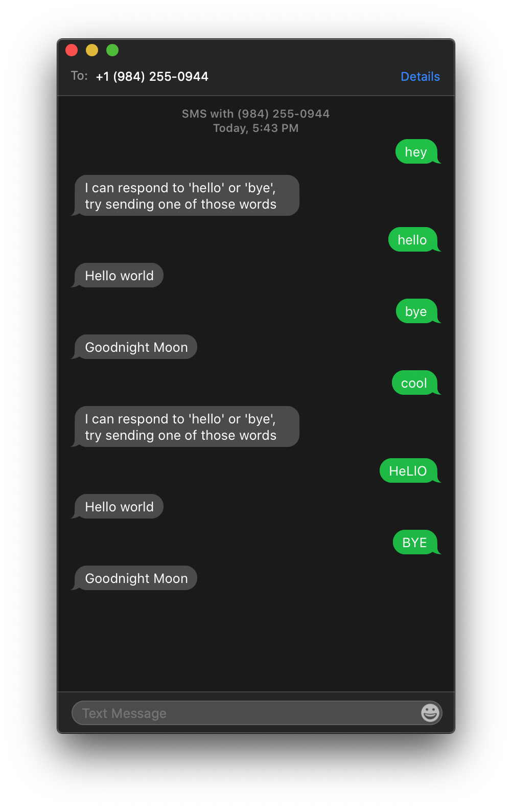

<div align="center">

# Telnyx Java Auto Response


Sample application demonstrating Java SDK Basics

</div>

## About

This application demonstrates:

* Receiving webhooks from Telnyx
* Parsing contents from inbound message
* Building an outbound message request
* Sending outbound message based on particular keyword

## Pre-Reqs

You will need to set up:

* [Telnyx Account](https://telnyx.com/sign-up?utm_source=referral&utm_medium=github_referral&utm_campaign=cross-site-link)
* Completed the messaging [Learn & Build](https://portal.telnyx.com/#/app/messaging/learn-and-build) to get your:
  * [Phone Number](https://portal.telnyx.com/#/app/numbers/my-numbers)
  * [Messaging Profile](https://portal.telnyx.com/#/app/messaging)
* Ability to receive webhooks (with something like [ngrok](https://developers.telnyx.com/docs/v2/development/ngrok?utm_source=referral&utm_medium=github_referral&utm_campaign=cross-site-link))
* [Java](https://developers.telnyx.com/docs/v2/development/dev-env-setup?lang=java) installed

## Usage

The following environmental variables need to be set

| Variable         | Description                                                                                                                                 |
|:-----------------|:--------------------------------------------------------------------------------------------------------------------------------------------|
| `TELNYX_API_KEY` | Your [Telnyx API Key](https://portal.telnyx.com/#/app/api-keys?utm_source=referral&utm_medium=github_referral&utm_campaign=cross-site-link) |

### .env file

This app uses the excellent [dotenv-java](https://github.com/cdimascio/dotenv-java) package to manage environment variables.

Make a copy of [`.env.sample`](./.env.sample) and save as `.env` and update the variables to match your creds.

```
TELNYX_API_KEY="KEYLoremIpsum"
```

### Callback URLs For Telnyx Applications

| Callback Type                    | URL                              |
|:---------------------------------|:---------------------------------|
| Inbound Message Callback         | `{ngrok-url}/messaging/inbound`  |
| Outbound Message Status Callback | `{ngrok-url}/messaging/outbound` _built at run time_ |

### Install

Run the following commands to get started

```
$ git clone https://github.com/d-telnyx/demo-java-telnyx.git
$ cd spring-messaging-auto-response
$ mvn clean install
```

### Ngrok

This application is served on the port defined in the runtime environment (or in the `.env` file). Be sure to launch [ngrok](https://developers.telnyx.com/docs/v2/development/ngrok?utm_source=referral&utm_medium=github_referral&utm_campaign=cross-site-link) for that port

```
./ngrok http 8000
```

> Terminal should look _something_ like

```
ngrok by @inconshreveable                                                                                                                               (Ctrl+C to quit)

Session Status                online
Account                       Little Bobby Tables (Plan: Free)
Version                       2.3.35
Region                        United States (us)
Web Interface                 http://127.0.0.1:4040
Forwarding                    http://your-url.ngrok.io -> http://localhost:8000
Forwarding                    https://your-url.ngrok.io -> http://localhost:8000

Connections                   ttl     opn     rt1     rt5     p50     p90
                              0       0       0.00    0.00    0.00    0.00
```

At this point you can point your application to generated ngrok URL + path  (Example: `http://{your-url}.ngrok.io/Callbacks/Voice/Inbound`).

## Run

Open your IDE and run the application to launch the spring server

Then text your Telnyx number from your mobile to get different responses!



## Development

Application was generated from SpringGenerators, see the [Help.md](HELP.md) for more information.

### ⚠️ FOR SPRING USERS

The SDK is built using [openapi-generator](https://github.com/OpenAPITools/openapi-generator), in order to use the deserializers, you need to include [jackson-databind-nullable](https://github.com/OpenAPITools/jackson-databind-nullable) (see [Stack Overflow](https://stackoverflow.com/questions/59524404/openapi-springboot-generator-jackson-no-string-argument-constructor-factory-meth))

#### Add to pom.xml

```xml
<dependency>
  <groupId>org.openapitools</groupId>
  <artifactId>jackson-databind-nullable</artifactId>
  <version>0.2.1</version>
</dependency>
```

#### Add to objectMapper

```java
@Autowired
void configureObjectMapper(final ObjectMapper mapper) {
    mapper.registerModule(new JsonNullableModule());
}
```
